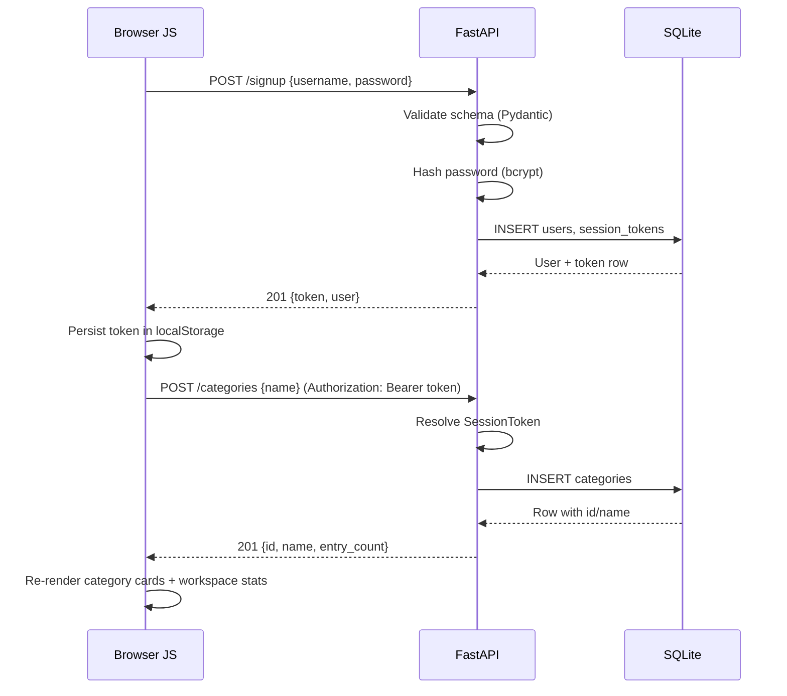
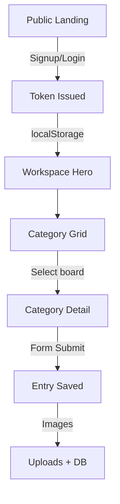

# StudioNotebook — Volume 1 (v1.1)

Version 1.1 is the first truly end-to-end slice of StudioNotebook. Users authenticate, land on a private dashboard, and create categories that contain structured entries, complete with uploads. This notebook documents the entire journey, the architecture, the data flow, and every issue we fought through to get here.

---

## Mission Brief
- **What we are building:** A studio-grade research archive. Each board (category) is a collection of specs, costs, notes, and image references for real architecture work.
- **Why it exists:** Crit prep usually means digging through old drives or half-finished slides. StudioNotebook keeps that research alive so the next design sprint starts with context instead of chaos.
- **Current release:** **StudioNotebook v1.1** – includes authentication, session management, category CRUD, entry tables, uploads, post-login workspace hero, and responsive tuning.

## Technology Stack (and the reasons we trust it)
| Layer | Tech | Reason |
| --- | --- | --- |
| API runtime | **FastAPI + uvicorn** | Async-ready, validation-first, instant OpenAPI docs, reload support for local sprints. |
| Data access | **SQLAlchemy ORM** | Declarative models, relationship management, easy swap to Postgres later. |
| Database | **SQLite** | File-based, zero ops, perfect for a personal lab while keeping SQL semantics real. |
| Auth hashing | **bcrypt 4.1.2** | Industry-safe hashing with salts; our direct usage avoids passlib conflicts. |
| Frontend | **HTML + CSS + Vanilla JS** | Transparent flow of network code and DOM updates; nothing masks the fetch lifecycle. |
| Static serving | **python -m http.server** | Lightweight HTTP server so browsers honor CORS and cookies correctly. |

## Architecture Map
```mermaid
flowchart LR
      UI[Browser UI\n(frontend/)] -- fetch / FormData --> API(FastAPI app\nbackend/main.py)
      API -- ORM session --> DB[(SQLite file\nnotes.db)]
      API -- Static mount --> Uploads[uploads/ directory]
      UI -- GET --> Uploads
```

## Request Lifecycle (Signup → Category Save)


## Frontend ↔ Backend Responsibilities
- **Frontend surface**
   - Landing hero + auth stack for anonymous visitors.
   - Workspace hero, stats, and category grid for authenticated visitors.
   - Category detail page with table-to-card responsive layout and entry form.
   - `safeFetch()` centralizes headers, error toasts, and 401 handling.
- **Backend surface**
   - Auth routes: `/signup`, `/login`, `/logout`, `/me`.
   - Category routes: `/categories`, `/categories/{id}` and entry/image endpoints.
   - Upload handling via FastAPI `UploadFile` and StaticFiles mount at `/uploads`.
   - Session token enforcement through dependency injection.

## Database Model (v1.1)
| Table | Key fields | Notes |
| --- | --- | --- |
| `users` | `id`, `username`, `password_hash` | Username unique per database file. |
| `session_tokens` | `token`, `user_id`, `created_at` | Token is UUID hex; deleting row = logout. |
| `categories` | `id`, `name`, `user_id` | Soft constraint ensures per-user scoping. |
| `entries` | `id`, `category_id`, `item_type`, `price`, `notes` | Price stored as nullable float. |
| `entry_images` | `id`, `entry_id`, `file_path` | Files saved under `backend/uploads`. |

## Development Chronicle (Idea → v1.1)
1. **Scaffold + DB wiring**: Built SQLAlchemy `engine`, `Base`, and tables. Brought up uvicorn with auto-reload and verified health route.
2. **Category + entry CRUD**: Implemented list/create/delete along with entry detail retrieval. Hooked up forms and template rendering in vanilla JS.
3. **Uploads**: Added `/uploads` static mount, `_attach_images` helper, and image chip UI.
4. **Authentication push**: Introduced signup/login/logout routes, bcrypt hashing, `SessionToken` enforcement, and frontend token persistence.
5. **Workspace surfaces**: Split landing hero vs workspace hero, added metrics (category count, entry count, latest board CTA), and auth-aware nav.
6. **Responsive tightening**: Rebuilt tables as stacked cards under 640 px, clamped html/body overflow, and tuned CTA layout for 412 px screens.

## Backend Concepts Explained Through StudioNotebook
- **POST vs GET**: GET is side-effect free (fetch categories, fetch entries). POST mutates state (create user, create category, logout). Uvicorn logs make it clear when each verb hits the API.
- **Payload entry point**: FastAPI automatically parses JSON bodies into `SignupRequest`, `LoginRequest`, or `CategoryCreate`. Multipart forms reach `_attach_images` through `UploadFile` streams.
- **Validation chain**: Pydantic checks schema shape → route-level logic checks business rules (unique username, category ownership) → SQLAlchemy writes or raises.
- **Response contract**: `schemas.py` defines the JSON we send back (`AuthResponse`, `CategoryRead`, `EntryRead`). Frontend relies on these shapes for rendering and for workspace stats.
- **JavaScript to Python handshake**:
   - `safeFetch` attaches `Authorization` headers whenever a token exists.
   - On 401, backend responds with JSON `{"detail": "Invalid or expired token"}`; frontend clears storage and redirects.
   - For uploads, the browser sends multipart boundaries; FastAPI streams files straight into `/uploads` before inserting DB rows.
- **Database fit**: Each request opens a SQLAlchemy session via `Depends(get_db)`. Transactions commit after inserts/updates, ensuring token + user writes land atomically.

## Operational Playbook
- **Start backend**: `D:/Noto/.venv/Scripts/python.exe -m uvicorn backend.main:app --reload`
- **Start frontend**: `python -m http.server 5500` from `frontend/`
- **API probe**: `Invoke-WebRequest -UseBasicParsing http://127.0.0.1:8000/` verifies FastAPI up.
- **Killing stragglers**: `Stop-Process -Id <PIDs>` when ports 8000 or 5500 are stuck.
- **Dependency sync**: `pip install -r requirements.txt` after editing backend dependencies (notably when switching to direct bcrypt).

## Incident Log (Every corner we hit)
| Incident | Root cause | Field symptoms | Resolution |
| --- | --- | --- | --- |
| **Port conflicts** | Old uvicorn or HTTP server still alive. | New server refused to bind; browser couldn’t reach API. | Listed Python processes and killed stray PIDs before relaunching both servers. |
| **Server boot failures** | Missing/incorrect deps after refactors. | uvicorn crashed on import, CLI printed stack trace. | Reinstalled via `pip install -r requirements.txt`, confirmed `.venv` activation, restarted uvicorn. |
| **CORS / Network errors** | Frontend opened via `file://` or backend crashed mid-request. | Browser console showed CORS block, toast displayed “Network error”. | Forced serving via `http.server`, added JS guard for `file://`, and stabilized backend (see bcrypt fix). |
| **bcrypt / passlib mismatch** | Passlib expected an older bcrypt build exposing `__about__`. | `/signup` returned 500, backend log screamed `AttributeError`. | Removed passlib dependency, imported `bcrypt` directly, pinned version 4.1.2, rewired `_hash_password` + `_verify_password`. |
| **Auto-reload disconnects** | WatchFiles reload triggered mid-fetch. | Fetch promise rejected; UI flashed “Network error”. | Toast explains the failure, retries after “Application startup complete” log shows; during longer edits we pause requests. |
| **Responsive overflow on 412 px** | Tables and hero padding wider than viewport. | Horizontal scroll on small Android breakpoints. | Added stacked table layout under 640 px, clamped html/body overflow, reduced paddings under 420 px. |

## Visual Cheat Sheet


## Lessons Locked In for v1.1
- Authentication reshapes both codebases: nav state, workspace hero, and API middle layers all feed off the same token system.
- `safeFetch` is the single choke point for network discipline—headers, error UX, and redirects stay consistent.
- Treating SQLite seriously pays off: cascades, ownership checks, and uploads already behave like a production stack even on a single file.
- Responsive polish is not optional; the app is meant for site visits on phones, so we chased the 412 px overflow until it died.
- Documenting every incident prevents phantom bugs next semester. This notebook is the canonical memory of v1.1.

**Next release target (v1.2 preview):** build on this base with entry analytics, exporting boards, and stronger session hygiene—without rewriting the fundamentals captured here.
